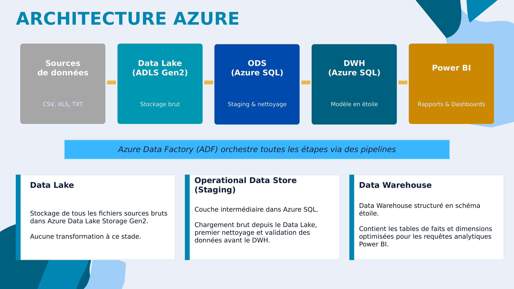
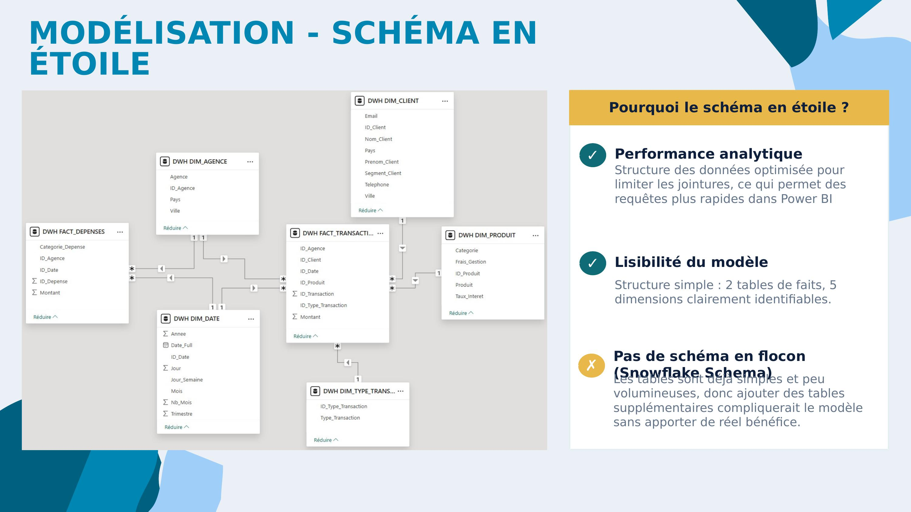
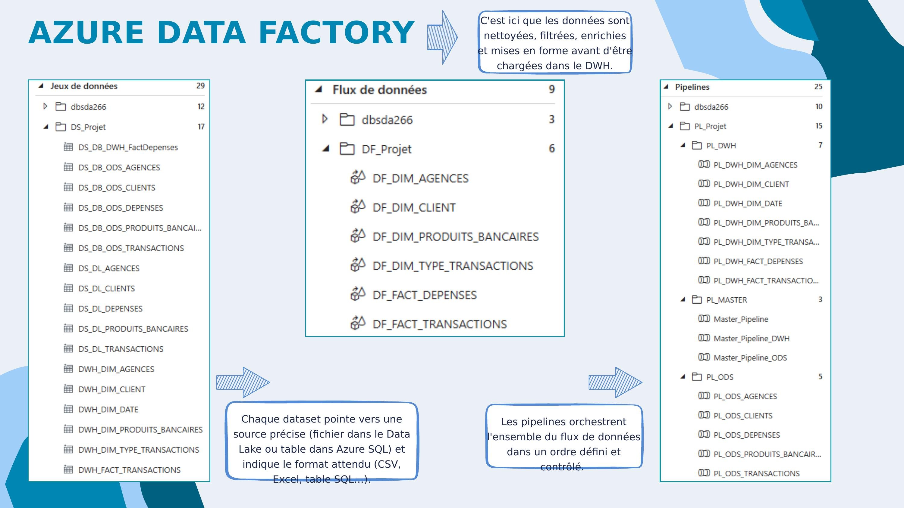
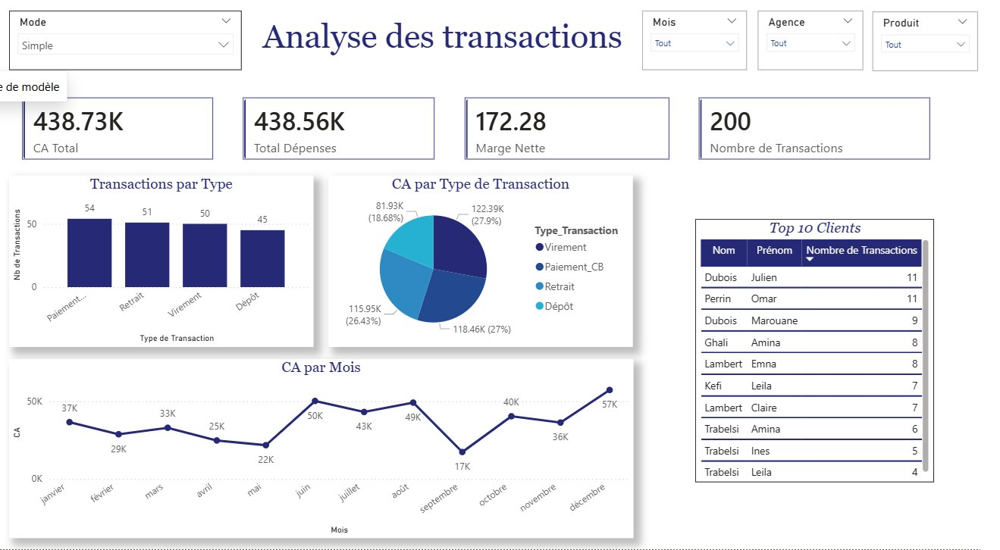
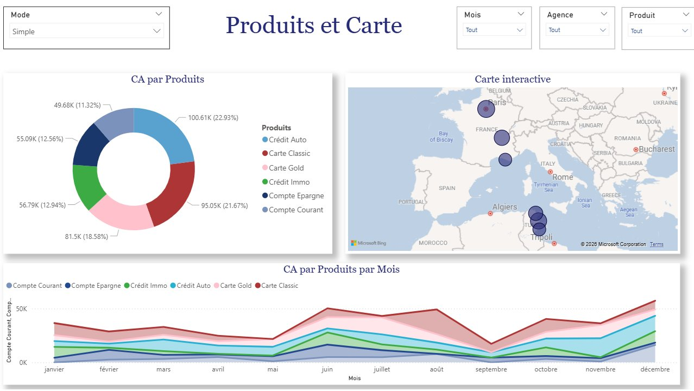
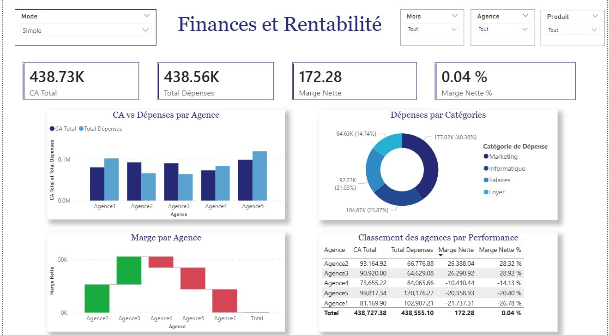

# 🏦 Bankia BI Project — Azure + Power BI


End-to-end Business Intelligence solution for **Bankia**, a fictional multi-branch bank.  
Built with a dual **Data Engineer + Data Analyst** approach — from raw source files to interactive Power BI dashboards.

---

## 📌 Project Overview

Bankia needed a decision-support system to centralise and historise its data, and to analyse its commercial and financial performance across branches and products.

This project covers the full data pipeline:

- **Phase 1 — Data Engineering**: Azure architecture, Data Lake ingestion, ODS staging, star-schema DWH, ADF orchestration
- **Phase 2 — Reporting**: Power BI dashboards with DAX measures, KPIs, and dynamic filters

---

## 🏗️ Architecture



| Layer | Technology | Role |
|-------|-----------|------|
| Source files | CSV, XLS, TXT | Raw input data |
| Data Lake | Azure Data Lake Storage Gen2 | Raw storage, no transformation |
| ODS | Azure SQL Database | Staging & data cleaning |
| DWH | Azure SQL Database | Star schema, analytics-ready |
| Orchestration | Azure Data Factory (ADF) | Pipeline automation |
| Reporting | Power BI | Dashboards & KPIs |

---

## 🗃️ Data Model — Star Schema



The DWH is structured as a **star schema** with:

**Fact tables:**
- `DWH_FACT_TRANSACTIONS` — client operations (type, amount, date, agency, product)
- `DWH_FACT_DEPENSES` — agency operating costs by category

**Dimension tables:**
- `DWH_DIM_CLIENT` — client info (segment, city, country)
- `DWH_DIM_AGENCE` — branch locations
- `DWH_DIM_PRODUIT` — banking products (accounts, loans, cards, savings)
- `DWH_DIM_DATE` — full date hierarchy (day, week, month, quarter, year)
- `DWH_DIM_TYPE_TRANSACTION` — transaction type reference

> Star schema chosen over snowflake for query performance and model readability in Power BI.

---

## ⚙️ Azure Data Factory



### Datasets (29 total)
- `DS_DL_*` — point to source files in the Data Lake
- `DS_DB_ODS_*` — point to ODS staging tables in Azure SQL
- `DWH_*` — point to DWH dimension and fact tables

### Data Flows (9 total)
Transformation logic for each entity:
`DF_DIM_AGENCES`, `DF_DIM_CLIENT`, `DF_DIM_PRODUITS_BANCAIRES`, `DF_DIM_TYPE_TRANSACTIONS`, `DF_FACT_DEPENSES`, `DF_FACT_TRANSACTIONS`

### Pipelines (25 total)

| Pipeline | Description |
|----------|-------------|
| `Master_Pipeline` | Full end-to-end run (ODS + DWH) |
| `Master_Pipeline_ODS` | Loads raw files into ODS staging |
| `Master_Pipeline_DWH` | Transforms ODS → star schema DWH |
| `PL_ODS_*` | Individual ODS loaders per entity |
| `PL_DWH_*` | Individual DWH loaders per entity |

---

## 📊 Power BI Report

The `.pbix` file contains 3 report pages with interactive visuals, DAX measures, and dynamic filters (by agency, by product, by time period).

### Page 1 — Analyse des Transactions


KPIs: CA Total (438.73K), Total Dépenses (438.56K), Marge Nette (172.28), Nombre de Transactions (200).
Visuals: transactions by type, revenue by transaction type, monthly CA trend, Top 10 clients.

### Page 2 — Produits et Carte


Revenue breakdown by product (donut chart), interactive geographic map of branches, monthly CA by product (area chart).

### Page 3 — Finances et Rentabilité


KPIs: CA Total, Total Dépenses, Marge Nette, Marge Nette %. CA vs. costs per agency (bar chart), expenses by category (donut), net margin per agency (waterfall), full agency performance ranking table.

**Key DAX measures:** revenues, net margin %, cumulative totals, top clients, monthly comparisons

---

## 📁 Repository Structure

```
Azure-PowerBI-Pipeline/
│
├── README.md
├── powerbi/
│   └── Bankia_Report.pbix          ← Power BI report file
├── presentation/
│   └── Azure___Power_BI.pptx       ← Project presentation
└── assets/
    └── screenshots/
        ├── architecture_azure.jpg  ← Azure architecture diagram
        ├── star_schema.jpg         ← DWH data model
        ├── adf_pipelines.jpg       ← ADF datasets, flows & pipelines
        └── context_data.jpg        ← Project context & data sources
```

---

## 🛠️ Tech Stack

- **Microsoft Azure** — ADLS Gen2, Azure SQL, Azure Data Factory
- **Power BI Desktop** — DAX, data modelling, interactive reports
- **SQL** — ODS and DWH table design
- **Data formats** — CSV, XLS, TXT

---

## 👥 Authors

- ALLISON Jacques
- MEGARD Alexandre
- NADAT Sufyan

*Université Paris 1 Panthéon-Sorbonne — 2026*
